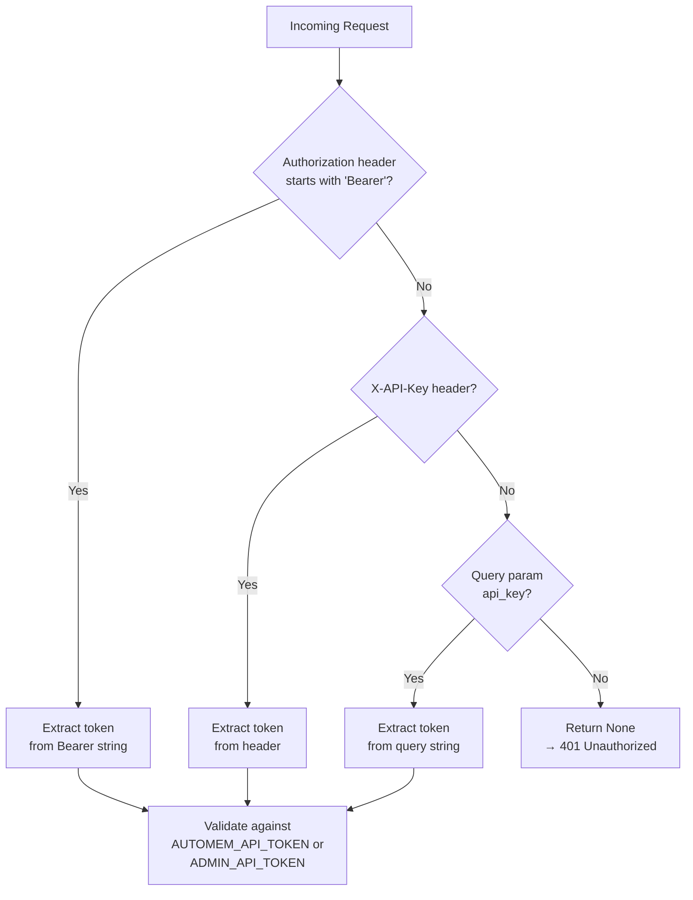
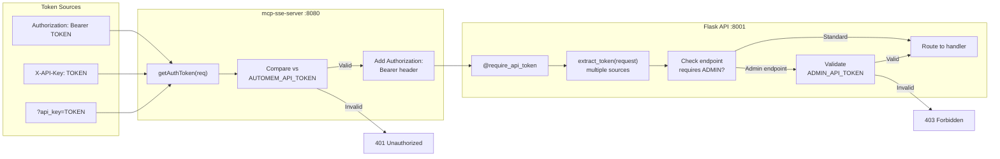
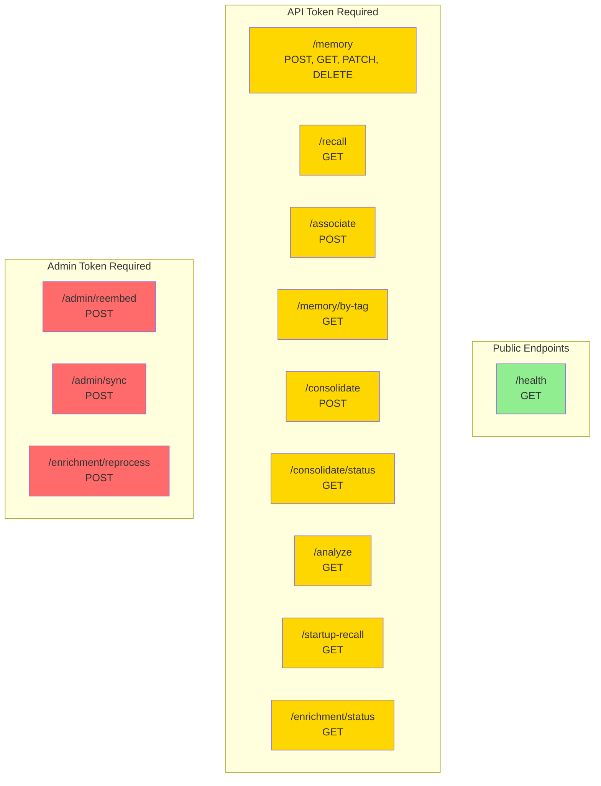

AutoMem uses a two-tier token-based authentication system to control access to different classes of operations. All endpoints except `/health` require a valid API token when `AUTOMEM_API_TOKEN` is configured.

For deployment-specific token generation on Railway, see [Railway Deployment](/docs/deployment/railway/). For complete endpoint documentation with authentication requirements, see [Memory Operations](/docs/reference/api/memory-operations/).

---

## Token Types

| Token Type | Environment Variable | Required For | Purpose |
|------------|---------------------|-------------|--------|
| **API Token** | `AUTOMEM_API_TOKEN` | All endpoints except `/health` | Standard memory operations (store, recall, update, delete) |
| **Admin Token** | `ADMIN_API_TOKEN` | Admin endpoints and `/enrichment/reprocess` | Privileged operations (reprocessing, re-embedding, bulk operations) |

---

## Authentication Methods

AutoMem accepts authentication credentials via three methods, checked in the following priority order:



### 1. Bearer Token (Recommended)

Standard OAuth 2.0-style authentication using the `Authorization` header:

```bash
curl -H "Authorization: Bearer YOUR_API_TOKEN" \
  https://your-service.railway.app/recall?q=query
```

**Advantages:**
- Industry standard
- Automatically handled by most HTTP libraries
- Cannot be logged in server access logs (more secure than query params)

### 2. Custom Header

Alternative header-based authentication using `X-API-Key` (only `X-API-Key` is checked — not `X-API-Token`):

```bash
curl -H "X-API-Key: YOUR_API_TOKEN" \
  https://your-service.railway.app/recall?q=query
```

Use this when client libraries do not support Bearer tokens easily.

### 3. Query Parameter

Fallback authentication via URL query string using only `api_key` (not `apiKey` or `api_token`):

```bash
curl "https://your-service.railway.app/recall?q=query&api_key=YOUR_API_TOKEN"
```

:::caution[Security warning]
Query parameters may be logged by proxies, load balancers, and web servers. Use only when headers are not feasible — for example, browser-based testing or webhooks with limited configuration options.
:::

---

## Full Token Validation Flow

This diagram shows how requests flow through both the MCP SSE server and the Flask API:



---

## Admin Authentication

Admin endpoints require **both** the API token and an additional admin token. The admin token is provided in a separate `X-Admin-Token` header:

```bash
curl -H "Authorization: Bearer YOUR_API_TOKEN" \
     -H "X-Admin-Token: YOUR_ADMIN_TOKEN" \
     -X POST https://your-service.railway.app/enrichment/reprocess
```

### Admin-Protected Endpoints

| Endpoint | Method | Purpose |
|----------|--------|---------|
| `/admin/reembed` | POST | Regenerate embeddings in batches |
| `/admin/sync` | POST | Non-destructive drift repair |
| `/enrichment/reprocess` | POST | Re-queue memories for enrichment |

Note: `/enrichment/status` requires an API token when `AUTOMEM_API_TOKEN` is configured — only `/health` is unconditionally public.

---

## Endpoint Authentication Requirements



| Category | Endpoints | API Token | Admin Token |
|----------|-----------|-----------|-------------|
| **Public** | `/health` | No | No |
| **Standard** | `/memory`, `/recall`, `/associate`, `/memory/by-tag`, `/consolidate`, `/consolidate/status`, `/analyze`, `/startup-recall`, `/enrichment/status` | Yes | No |
| **Admin** | `/admin/reembed`, `/admin/sync`, `/enrichment/reprocess` | Yes | Yes |

---

## Configuration

### Environment Variables

Configure authentication tokens via environment variables loaded in this order:

1. Process environment (e.g., `export AUTOMEM_API_TOKEN=...`)
2. `.env` file in project root
3. `~/.config/automem/.env` (user-specific configuration)

The variables `API_TOKEN` and `ADMIN_TOKEN` are accepted as backward-compatible aliases for `AUTOMEM_API_TOKEN` and `ADMIN_API_TOKEN` respectively.

### Token Generation

**Railway (Automatic):**

For Railway deployments, set `AUTOMEM_API_TOKEN` and `ADMIN_API_TOKEN` as Railway environment variables or generated secrets in the service configuration. The repo no longer ships a standalone `railway-template.json` for this.

**Manual (Local Development):**

Generate secure tokens using OpenSSL:

```bash
# Generate API token
openssl rand -hex 32

# Generate Admin token (use a different value)
openssl rand -hex 32
```

---

## Client Integration Examples

### Python (requests)

```python
import requests

headers = {
    "Authorization": f"Bearer {api_token}",
    "Content-Type": "application/json"
}

response = requests.post(
    "https://your-service.railway.app/memory",
    headers=headers,
    json={"content": "Important decision made today", "type": "Decision"}
)
```

### JavaScript (fetch)

```javascript
const response = await fetch("https://your-service.railway.app/recall?q=decisions", {
  headers: {
    "Authorization": `Bearer ${apiToken}`,
  }
});
const data = await response.json();
```

### cURL

```bash
# Store a memory
curl -X POST https://your-service.railway.app/memory \
  -H "Authorization: Bearer YOUR_TOKEN" \
  -H "Content-Type: application/json" \
  -d '{"content": "Prefer PostgreSQL for relational data", "type": "Preference"}'

# Recall memories
curl "https://your-service.railway.app/recall?q=database+preferences" \
  -H "Authorization: Bearer YOUR_TOKEN"
```

---

## MCP Client Authentication

### NPM Package (@verygoodplugins/mcp-automem)

Desktop tools like Claude Desktop and Cursor IDE use the NPM package, which requires API token configuration in the platform's MCP config file:

```json
{
  "mcpServers": {
    "automem": {
      "command": "npx",
      "args": ["-y", "@verygoodplugins/mcp-automem"],
      "env": {
        "AUTOMEM_API_URL": "https://your-service.railway.app",
        "AUTOMEM_API_KEY": "YOUR_API_TOKEN"
      }
    }
  }
}
```

The client automatically injects the token as `Authorization: Bearer` header on all requests.

### SSE Bridge (mcp-sse-server)

For cloud-based AI platforms (ChatGPT, ElevenLabs), the SSE bridge requires `AUTOMEM_API_TOKEN` set in the Railway environment. The bridge validates incoming requests against this token and forwards them to the AutoMem API transparently.

---

## Security Best Practices

| Practice | Description | Priority |
|----------|-------------|---------|
| **Strong tokens** | Use cryptographically random tokens (32+ bytes) | Critical |
| **Environment variables** | Never hardcode tokens in code or commit to Git | Critical |
| **Separate admin tokens** | Use different tokens for API and admin access | Critical |
| **HTTPS only** | Always use HTTPS in production (Railway provides automatically) | Critical |
| **Prefer Bearer auth** | Use `Authorization: Bearer` over query params | High |
| **Rotate regularly** | Change tokens every 90 days or after suspected exposure | High |
| **Environment separation** | Different tokens for dev/staging/production | High |
| **Monitor logs** | Watch for 401 errors indicating unauthorized attempts | Medium |
| **Audit trail** | Log who performs admin operations (via admin token) | Medium |

### Common Security Mistakes

| Mistake | Risk | Solution |
|---------|------|----------|
| Committing tokens to Git | Public exposure, unauthorized access | Use `.gitignore`, environment variables |
| Using same token everywhere | Single point of compromise | Separate tokens per environment |
| Query param authentication in production | Tokens logged in server logs | Use Bearer header |
| No admin token separation | Anyone with API access can perform admin ops | Configure separate `ADMIN_API_TOKEN` |
| Weak tokens (e.g., "password123") | Easy to guess/brute force | Use cryptographic generators |

### Token Rotation Procedure

When rotating tokens (for example, after suspected exposure or periodic maintenance):

1. Generate new tokens: `openssl rand -hex 32`
2. Update server environment variables (Railway dashboard or CLI)
3. Update all clients with new tokens before removing old tokens
4. Test connectivity with new tokens
5. Remove old tokens from server configuration entirely
6. Restart the service to ensure old tokens are not cached

---

## Troubleshooting

### 401 Unauthorized

**Symptom:** All requests return `401 Unauthorized`

**Common causes:**

1. Token not set in environment variable — verify with `echo $AUTOMEM_API_TOKEN`
2. Typo in token value — check for trailing spaces or newlines
3. Using wrong token (API token vs admin token)
4. Token mismatch between client and server

**Diagnosis:**

```bash
# Test your token directly
curl -v -H "Authorization: Bearer YOUR_TOKEN" \
  https://your-service.railway.app/recall?q=test
```

### Admin Endpoint Returns 401

**Symptom:** Standard endpoints work, but admin endpoints return `401 Unauthorized`

**Common causes:**

1. Missing `X-Admin-Token` header — admin endpoints require both headers
2. `ADMIN_API_TOKEN` not configured on server
3. Admin token mismatch between client and server

### Token Exposure Response

**If a token is exposed (committed to Git, shared in logs):**

1. **Immediate rotation:** Generate a new token and update server configuration — deploy immediately
2. **Audit access:** Check server logs for unauthorized requests; look for unusual patterns in `/health` or `/analyze` endpoints
3. **Revoke old token:** Remove from environment variables and restart the service to ensure it is not cached
