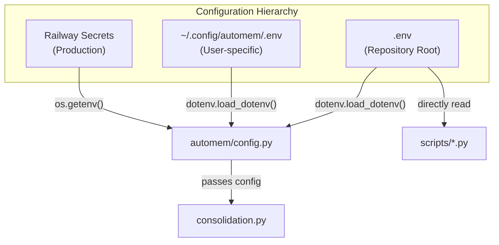
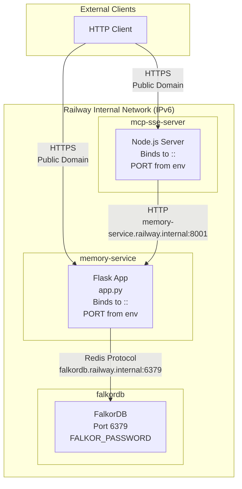
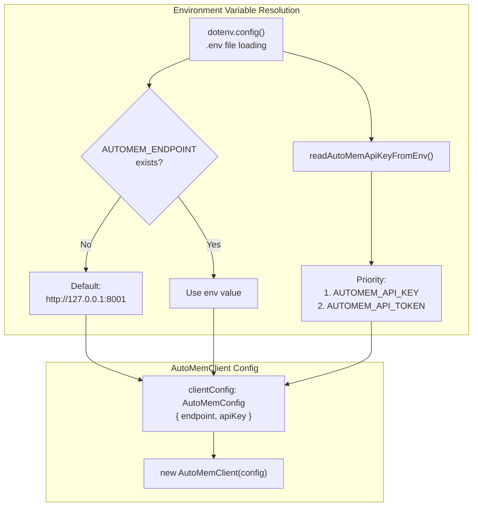
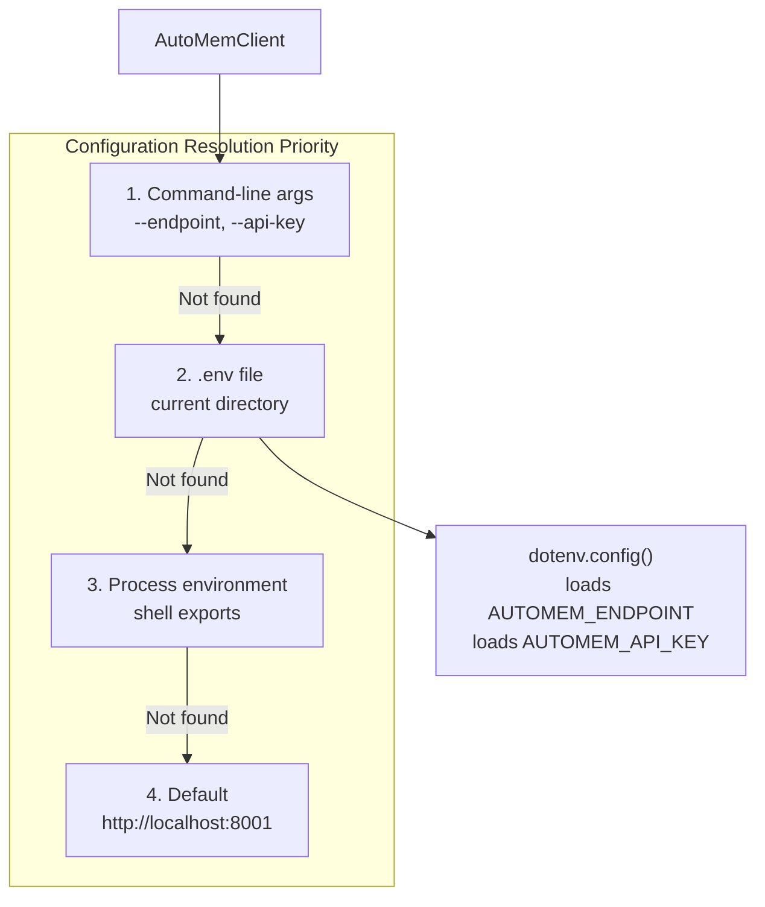
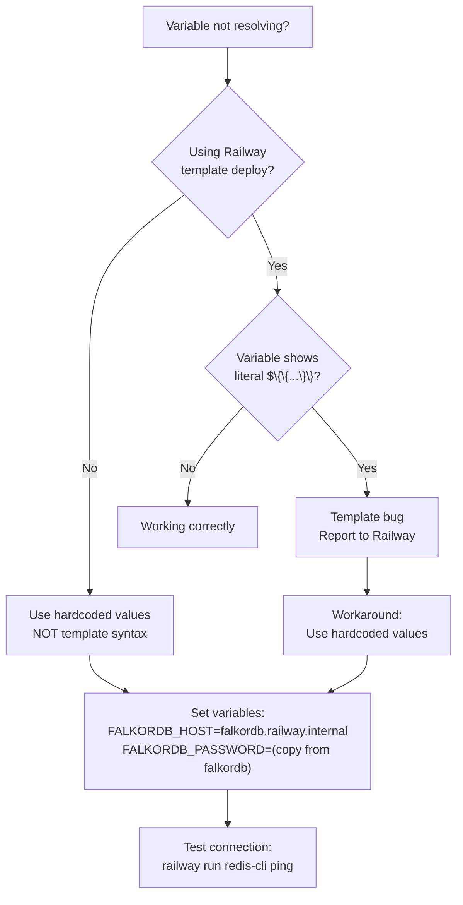

This page provides a complete reference for all environment variables and configuration options used in AutoMem. Configuration controls service connectivity, authentication, embedding generation, background processing, and search behavior.

For a quick-reference table grouped by category, see [Environment Variables](/docs/getting-started/environment-variables/). For deployment-specific setup, see [Docker & Local Dev](/docs/getting-started/docker/) or [Railway Deployment](/docs/deployment/railway/).

---

## Configuration Loading

AutoMem loads environment variables from multiple sources in a specific precedence order, allowing flexible configuration across different deployment scenarios.

**Load order (highest to lowest priority):**

1. **Process environment** — Variables set via `export` or passed directly to the process
2. **Project `.env`** — File in repository root
3. **User config** — `~/.config/automem/.env` (user-specific, never committed)

This hierarchy allows local overrides without modifying shared configuration files. For example, a developer can set `FALKORDB_HOST=localhost` in their user config while the project `.env` contains shared development defaults.



---

## Server Configuration

### Core Service Connection

Required configuration for connecting to data stores:

| Variable | Type | Required | Default | Description |
|----------|------|----------|---------|-------------|
| `FALKORDB_HOST` | string | Yes | `localhost` | Graph database hostname |
| `FALKORDB_PORT` | int | Yes | `6379` | Graph database port |
| `FALKORDB_PASSWORD` | string | No | _unset_ | Redis/FalkorDB password if auth enabled |
| `FALKORDB_GRAPH` | string | No | `memories` | Graph database name (Cypher `GRAPH.QUERY` target) |
| `GRAPH_NAME` | string | No | `memories` | Alias for `FALKORDB_GRAPH` |
| `PORT` | int | No | `8001` | Flask API server port |



:::caution[Railway PORT requirement]
Railway requires `PORT=8001` explicitly set. Flask defaults to port 5000 if unset, causing `ECONNREFUSED` errors when the MCP bridge or health monitors attempt connection via `*.railway.internal:8001`.
:::

### Vector Search (Optional)

Qdrant configuration enables semantic search but is not required. AutoMem operates in graph-only mode if these are unset:

| Variable | Type | Required | Default | Description |
|----------|------|----------|---------|-------------|
| `QDRANT_URL` | string | No | _unset_ | Qdrant API endpoint (HTTP/HTTPS) |
| `QDRANT_HOST` | string | No | _unset_ | Qdrant hostname (alternative to `QDRANT_URL`) |
| `QDRANT_PORT` | int | No | `6333` | Qdrant port (used with `QDRANT_HOST`) |
| `QDRANT_API_KEY` | string | No | _unset_ | Qdrant authentication key (required for cloud) |
| `QDRANT_COLLECTION` | string | No | `memories` | Collection name for memory vectors |
| `COLLECTION_NAME` | string | No | `memories` | Alias for `QDRANT_COLLECTION` |
| `VECTOR_SIZE` | int | No | `1024` | Embedding dimension (768/1024/2048/3072) |

:::caution[Dimension compatibility]
AutoMem performs dimension validation before writing to Qdrant. Mismatches raise `ValueError` to prevent corrupting the vector store. When migrating dimensions, keep `VECTOR_SIZE` matching the existing collection until re-embedding completes.
:::

### Authentication

All endpoints except `/health` require authentication:

| Variable | Type | Required | Default | Description |
|----------|------|----------|---------|-------------|
| `AUTOMEM_API_TOKEN` | string | Yes | _unset_ | Authentication token for standard operations |
| `ADMIN_API_TOKEN` | string | Yes | _unset_ | Token for admin endpoints (`/admin/*`, `/enrichment/reprocess`) |
| `API_TOKEN` | string | No | _unset_ | Fallback alias for `AUTOMEM_API_TOKEN` |
| `ADMIN_TOKEN` | string | No | _unset_ | Fallback alias for `ADMIN_API_TOKEN` |

:::tip
Query parameter authentication (`?api_key=`) is supported but discouraged in production due to log exposure. Use Bearer tokens for API clients and header-based authentication for MCP bridges. See [Authentication](/docs/reference/authentication/) for full details.
:::

### Embedding Provider Configuration

Controls embedding generation with automatic provider selection:

| Variable | Type | Required | Default | Description |
|----------|------|----------|---------|-------------|
| `EMBEDDING_PROVIDER` | string | No | `auto` | Provider selection mode (`auto`/`voyage`/`openai`/`local`/`ollama`/`placeholder`) |
| `EMBEDDING_MODEL` | string | No | `text-embedding-3-small` | OpenAI model name or identifier |
| `VOYAGE_API_KEY` | string | No | _unset_ | Voyage AI API key |
| `VOYAGE_MODEL` | string | No | `voyage-4` | Voyage model (`voyage-4`, `voyage-4-large`) |
| `OPENAI_API_KEY` | string | No | _unset_ | OpenAI or compatible provider API key |
| `OPENAI_BASE_URL` | string | No | _unset_ | Custom endpoint for OpenAI-compatible APIs (OpenRouter, LiteLLM, vLLM) |
| `OLLAMA_BASE_URL` | string | No | `http://localhost:11434` | Ollama server endpoint |
| `OLLAMA_MODEL` | string | No | `nomic-embed-text` | Ollama embedding model name |

**Provider characteristics:**

| Provider | Quality | Cost | Offline | Dimensions | API Key |
|----------|---------|------|---------|------------|---------|
| Voyage | Excellent | $0.00012/1K tokens | No | 256/512/1024/2048 | Required |
| OpenAI | Excellent | $0.00002–$0.00013/1K tokens | No | 768/3072 | Required |
| Ollama | Good | Free | Yes | Model-dependent | Not required |
| FastEmbed | Good | Free | Yes (after download) | 384/768/1024 | Not required |
| Placeholder | None | Free | Yes | Configurable | Not required |

When `EMBEDDING_PROVIDER=auto`, the provider is selected by checking API key availability in order: Voyage, then OpenAI, then local/Ollama, then placeholder.

:::note[OpenAI-compatible providers]
When `OPENAI_BASE_URL` is set, the OpenAI provider becomes compatible with third-party endpoints. The provider omits the `dimensions` parameter for non-OpenAI URLs to avoid compatibility issues with OpenRouter, LiteLLM, and similar proxies.
:::

### Embedding Batching

Controls batch processing to reduce API costs:

| Variable | Type | Required | Default | Description |
|----------|------|----------|---------|-------------|
| `EMBEDDING_BATCH_SIZE` | int | No | `20` | Items per batch API call |
| `EMBEDDING_BATCH_TIMEOUT_SECONDS` | float | No | `2.0` | Max wait time before flushing partial batch |

Batching reduces API costs by 40–50% by combining multiple embedding requests into single API calls. The timeout ensures reasonable latency even when traffic is low.

### Enrichment Pipeline

Controls automatic background enrichment after memory storage:

| Variable | Type | Required | Default | Description |
|----------|------|----------|---------|-------------|
| `ENRICHMENT_MAX_ATTEMPTS` | int | No | `3` | Retry limit before marking failed |
| `ENRICHMENT_SIMILARITY_LIMIT` | int | No | `5` | Number of semantic neighbors to link |
| `ENRICHMENT_SIMILARITY_THRESHOLD` | float | No | `0.8` | Min cosine similarity for `SIMILAR_TO` edge |
| `ENRICHMENT_IDLE_SLEEP_SECONDS` | int | No | `2` | Worker sleep duration when queue empty |
| `ENRICHMENT_FAILURE_BACKOFF_SECONDS` | int | No | `5` | Delay between retry attempts |
| `ENRICHMENT_ENABLE_SUMMARIES` | bool | No | `true` | Auto-generate memory summaries |
| `ENRICHMENT_SPACY_MODEL` | string | No | `en_core_web_sm` | spaCy model for NER (if installed) |
| `JIT_ENRICHMENT_ENABLED` | bool | No | `true` | Run enrichment inline on store (just-in-time) |

**Entity tag generation:**

Extracted entities become structured tags with the pattern `entity:<type>:<slug>`:

| Entity Type | Example Input | Generated Tag |
|-------------|---------------|---------------|
| Tool | `PostgreSQL` | `entity:tool:postgresql` |
| Project | `automem` | `entity:project:automem` |
| Person | `Sarah` | `entity:person:sarah` |
| Organization | `OpenAI` | `entity:organization:openai` |
| Concept | `ACID compliance` | `entity:concept:acid-compliance` |

### Consolidation Engine

Controls background memory maintenance cycles:

| Variable | Type | Required | Default | Description |
|----------|------|----------|---------|-------------|
| `CONSOLIDATION_TICK_SECONDS` | int | No | `60` | Scheduler check interval |
| `CONSOLIDATION_DECAY_INTERVAL_SECONDS` | int | No | `86400` | Decay cycle frequency (1 day) |
| `CONSOLIDATION_DECAY_IMPORTANCE_THRESHOLD` | float | No | `0.3` | Min importance to process in decay |
| `CONSOLIDATION_CREATIVE_INTERVAL_SECONDS` | int | No | `604800` | Creative cycle frequency (1 week) |
| `CONSOLIDATION_CLUSTER_INTERVAL_SECONDS` | int | No | `2592000` | Cluster cycle frequency (1 month) |
| `CONSOLIDATION_FORGET_INTERVAL_SECONDS` | int | No | `0` | Forget cycle frequency (disabled by default) |
| `CONSOLIDATION_ARCHIVE_THRESHOLD` | float | No | `0.0` | Relevance threshold for archiving (0.0 = disabled) |
| `CONSOLIDATION_DELETE_THRESHOLD` | float | No | `0.0` | Relevance threshold for deletion (0.0 = disabled) |
| `CONSOLIDATION_GRACE_PERIOD_DAYS` | int | No | `90` | Min age before memory can be forgotten |
| `CONSOLIDATION_IMPORTANCE_PROTECTION_THRESHOLD` | float | No | `0.7` | Memories above this importance are protected |
| `CONSOLIDATION_PROTECTED_TYPES` | string | No | `Decision,Insight` | Comma-separated types to never forget |
| `CONSOLIDATION_BASE_DECAY_RATE` | float | No | `0.01` | Base rate applied per decay cycle |
| `CONSOLIDATION_IMPORTANCE_FLOOR_FACTOR` | float | No | `0.3` | Minimum importance fraction after decay |

**Consolidation task details:**

| Task | Cypher Operation | Purpose | Protected Conditions |
|------|-----------------|---------|---------------------|
| Decay | `SET m.importance = m.importance * decay_factor` | Exponential relevance reduction | `type IN PROTECTED_TYPES` OR `importance > IMPORTANCE_PROTECTION_THRESHOLD` |
| Creative | `MATCH (m1:Memory)-[*..3]-(m2:Memory)` | Multi-hop association discovery | N/A |
| Cluster | `MATCH (m:Memory) ... CREATE (p:Pattern)` | Pattern node generation | N/A |
| Forget | `SET m.archived = true` or `DELETE m` | Archive/remove low-value memories | Age < `GRACE_PERIOD_DAYS` OR protected conditions |

### Search Scoring Weights

Fine-tune hybrid search ranking. Weights are applied to individual signals and summed to produce a final score:

| Variable | Type | Required | Default | Description |
|----------|------|----------|---------|-------------|
| `SEARCH_WEIGHT_VECTOR` | float | No | `0.35` | Vector similarity component |
| `SEARCH_WEIGHT_KEYWORD` | float | No | `0.35` | Keyword/TF-IDF matching |
| `SEARCH_WEIGHT_TAG` | float | No | `0.20` | Tag overlap score |
| `SEARCH_WEIGHT_IMPORTANCE` | float | No | `0.10` | User-assigned importance |
| `SEARCH_WEIGHT_RECENCY` | float | No | `0.10` | Freshness boost |
| `SEARCH_WEIGHT_CONFIDENCE` | float | No | `0.05` | Memory confidence score |
| `SEARCH_WEIGHT_EXACT` | float | No | `0.20` | Content token overlap |
| `SEARCH_WEIGHT_RELATION` | float | No | `0.25` | Graph relation proximity boost |
| `SEARCH_WEIGHT_RELEVANCE` | float | No | `0.0` | LLM-scored relevance (disabled by default) |

Adjust weights to favor specific signals for your use case.

### Recall Behavior

Controls query result expansion and limits:

| Variable | Type | Required | Default | Description |
|----------|------|----------|---------|-------------|
| `RECALL_MAX_LIMIT` | int | No | `100` | Maximum results returned by `/recall` |
| `RECALL_RELATION_LIMIT` | int | No | `5` | Max related memories per result |
| `RECALL_EXPANSION_LIMIT` | int | No | `25` | Max memories added via `expand_relations=true` |
| `RECALL_MIN_SCORE` | float | No | `0.0` | Minimum score threshold for returned results |
| `RECALL_ADAPTIVE_FLOOR` | bool | No | `true` | Dynamically adjust score floor based on result set |

### Sync Worker (Drift Repair)

Controls automatic drift detection between FalkorDB and Qdrant:

| Variable | Type | Required | Default | Description |
|----------|------|----------|---------|-------------|
| `SYNC_CHECK_INTERVAL_SECONDS` | int | No | `3600` | Frequency of drift checks (1 hour) |
| `SYNC_AUTO_REPAIR` | bool | No | `true` | Automatically queue missing embeddings |

The sync worker counts memories in FalkorDB vs Qdrant and queues repair operations when drift exceeds 5%.

### Memory Type Configuration

Controls classification and relationship validation:

| Variable | Type | Required | Default | Description |
|----------|------|----------|---------|-------------|
| `MEMORY_TYPES` | string | No | See below | Comma-separated valid memory types |
| `RELATIONSHIP_TYPES` | string | No | See below | Comma-separated valid relationship types |
| `ALLOWED_RELATIONS` | string | No | Same as `RELATIONSHIP_TYPES` | Alias for backward compatibility |

**Default memory types:**

```
Decision, Pattern, Preference, Style, Habit, Insight, Context
```

`Memory` is a legacy alias for `Context` and is normalized on write; it is not a canonical type.

**Default relationship types:**

```
RELATES_TO, LEADS_TO, OCCURRED_BEFORE, PREFERS_OVER, EXEMPLIFIES,
CONTRADICTS, REINFORCES, INVALIDATED_BY, EVOLVED_INTO, DERIVED_FROM, PART_OF,
SIMILAR_TO, PRECEDED_BY, DISCOVERED
```

**Type aliases** — The `TYPE_ALIASES` mapping in `automem.config` normalizes variations:

| Input | Normalized To |
|-------|--------------|
| `decision`, `decisions` | `Decision` |
| `pattern`, `patterns` | `Pattern` |
| `preference`, `preferences` | `Preference` |
| `fact`, `facts`, `knowledge` | `Context` |

### Classification Model

Controls LLM-based memory classification fallback:

| Variable | Type | Required | Default | Description |
|----------|------|----------|---------|-------------|
| `CLASSIFICATION_MODEL` | string | No | `gpt-4o-mini` | OpenAI model for content classification |

When an explicit `type` is not provided in the request, or regex patterns fail to match, AutoMem uses the LLM classification model. The system prompt for classification is defined in `MemoryClassifier.SYSTEM_PROMPT` in [`app.py`](https://github.com/verygoodplugins/automem/blob/main/app.py).

### Memory Content Governance

Controls content size limits and automatic summarization:

| Variable | Type | Required | Default | Description |
|----------|------|----------|---------|-------------|
| `MEMORY_CONTENT_SOFT_LIMIT` | int | No | `500` | Character threshold above which a warning is issued and auto-summarize may trigger |
| `MEMORY_CONTENT_HARD_LIMIT` | int | No | `2000` | Character limit above which the request is rejected immediately |
| `MEMORY_AUTO_SUMMARIZE` | bool | No | `true` | Automatically summarize content exceeding the soft limit |
| `MEMORY_SUMMARY_TARGET_LENGTH` | int | No | `300` | Target character length for auto-generated summaries |

---

## MCP Client Configuration

The `mcp-automem` client uses two primary environment variables to locate and authenticate with the AutoMem backend service. These can be set via `.env` file, shell environment, or platform-specific MCP configuration files.

| Variable | Required | Default | Description |
|----------|----------|---------|-------------|
| `AUTOMEM_ENDPOINT` | Yes | `http://127.0.0.1:8001` | HTTP URL of the AutoMem service |
| `AUTOMEM_API_KEY` | No | (none) | API key for authenticated instances (preferred name) |
| `AUTOMEM_API_TOKEN` | No | (none) | Alternative name for the API key |
| `AUTOMEM_PROCESS_TAG` | No | (none) | Process title tag for safe cleanup in multi-process environments |
| `MCP_PROCESS_TAG` | No | (none) | Alternative process tag variable |
| `AUTOMEM_LOG_LEVEL` | No | (none) | Set to `debug` for verbose logging |

**Common endpoint values:**
- Local development: `http://127.0.0.1:8001` or `http://localhost:8001`
- Railway deployment: `https://your-service.railway.app`
- Custom deployment: Your service's public or internal URL

**API key resolution order** — The `readAutoMemApiKeyFromEnv()` function checks variables in this priority order:



### Configuration Resolution Priority

The client resolves configuration from multiple sources with a defined priority order:



1. **Environment variables** (highest priority) — Direct shell environment or `.env` file or platform-specific MCP server `env` blocks
2. **`~/.claude.json` configuration** — Used by CLI commands when environment is not set; scans all `mcpServers` entries for AutoMem config
3. **Default values** (lowest priority) — `endpoint`: `http://127.0.0.1:8001`, `apiKey`: `undefined`

### Platform-Specific Configuration Files

Each AI platform stores MCP server configuration differently:

| Platform | Configuration File | Format |
|----------|-------------------|--------|
| Claude Desktop | `~/Library/Application Support/Claude/claude_desktop_config.json` (macOS) | JSON |
| Claude Desktop | `%APPDATA%\Claude\claude_desktop_config.json` (Windows) | JSON |
| Claude Desktop | `~/.config/Claude/claude_desktop_config.json` (Linux) | JSON |
| Cursor IDE | `~/.cursor/mcp.json` | JSON |
| Claude Code | `~/.claude.json` | JSON |
| Codex | `~/.codex/config.toml` | TOML |
| OpenClaw | `~/.openclaw/openclaw.json` | JSON |

**JSON configuration example (Claude Desktop, Cursor, Claude Code):**

```json
{
  "mcpServers": {
    "automem": {
      "command": "npx",
      "args": ["-y", "@verygoodplugins/mcp-automem"],
      "env": {
        "AUTOMEM_ENDPOINT": "https://your-service.railway.app",
        "AUTOMEM_API_KEY": "your-api-token"
      }
    }
  }
}
```

The `command` and `args` launch the MCP server in stdio mode. The `env` block passes configuration to the server process.

**TOML configuration example (Codex):**

```toml
[mcp.servers.automem]
command = "npx"
args = ["-y", "@verygoodplugins/mcp-automem"]

[mcp.servers.automem.env]
AUTOMEM_ENDPOINT = "https://your-service.railway.app"
AUTOMEM_API_KEY = "your-api-token"
```

### Content Size Governance

The `store_memory` tool enforces content size limits to maintain embedding quality:

| Limit Type | Threshold | Behavior |
|------------|-----------|---------|
| Soft limit | 500 characters | Warning; backend may auto-summarize |
| Hard limit | 2000 characters | Rejected immediately with error |

### MCP Client Validation

The setup wizard validates the endpoint before saving configuration:

1. **URL format check** — Ensures `AUTOMEM_ENDPOINT` is a valid HTTP/HTTPS URL
2. **Health endpoint probe** — Sends `GET /health` request with 2-second timeout
3. **Database status check** — Verifies FalkorDB and Qdrant connectivity
4. **Configuration write** — Saves validated config to `.env`

At runtime, if the endpoint is unreachable, queue operations are skipped rather than blocking. This prevents queue operations from stalling when the service is temporarily down.

---

## Advanced Configuration

### Logging and Debug

| Variable | Type | Required | Default | Description |
|----------|------|----------|---------|-------------|
| `LOG_LEVEL` | string | No | `INFO` | Python logging level (`DEBUG`, `INFO`, `WARNING`, `ERROR`) |
| `FLASK_ENV` | string | No | `production` | Flask environment mode |

### Testing Configuration

| Variable | Type | Required | Default | Description |
|----------|------|----------|---------|-------------|
| `AUTOMEM_RUN_INTEGRATION_TESTS` | bool | No | `0` | Enable integration test suite |
| `AUTOMEM_START_DOCKER` | bool | No | `0` | Auto-start Docker Compose for tests |
| `AUTOMEM_STOP_DOCKER` | bool | No | `0` | Auto-stop Docker after tests |
| `AUTOMEM_TEST_BASE_URL` | string | No | `http://localhost:8001` | Test target URL |
| `AUTOMEM_ALLOW_LIVE` | bool | No | `0` | Allow tests against non-localhost |
| `AUTOMEM_TEST_API_TOKEN` | string | No | _unset_ | Token for integration tests |
| `AUTOMEM_TEST_ADMIN_TOKEN` | string | No | _unset_ | Admin token for integration tests |

---

## Configuration Validation

AutoMem validates critical configuration at startup with fail-fast behavior for critical misconfigurations and graceful degradation for optional features:

| Variable | Validation | Failure Behavior |
|----------|-----------|-----------------|
| `FALKORDB_HOST`, `FALKORDB_PORT` | Connection test on startup | 503 Service Unavailable |
| `AUTOMEM_API_TOKEN` | Must be non-empty string | 500 Internal Server Error |
| `ADMIN_API_TOKEN` | Must be non-empty string | 500 Internal Server Error |
| `PORT` | Must be valid port number | Defaults to 8001 |
| `QDRANT_URL` | Connection test if provided | Log warning, continue |
| `VECTOR_SIZE` | Must match Qdrant collection | Fail fast on mismatch |
| `EMBEDDING_PROVIDER` | Must be valid option | Defaults to `auto` |

The health endpoint at `GET /health` reflects connection status and can be used to verify configuration:

```json
{
  "status": "healthy",
  "falkordb": "connected",
  "qdrant": "connected",
  "memory_count": 142,
  "enrichment": {
    "status": "running",
    "queue_depth": 0
  },
  "graph": "memories"
}
```

When Qdrant is unavailable (expected in graph-only mode):

```json
{
  "status": "healthy",
  "falkordb": "connected",
  "qdrant": "unavailable",
  "memory_count": 142
}
```

---

## Configuration Examples

### Minimal local setup (graph-only, no vector search)

```bash
AUTOMEM_API_TOKEN=your-token-here
ADMIN_API_TOKEN=your-admin-token-here
FALKORDB_HOST=localhost
FALKORDB_PORT=6379
PORT=8001
```

### Railway production deployment

```bash
PORT=8001
FALKORDB_HOST=falkordb.railway.internal
FALKORDB_PORT=6379
FALKORDB_PASSWORD=<generated-by-template>
AUTOMEM_API_TOKEN=<generated-by-template>
ADMIN_API_TOKEN=<generated-by-template>
OPENAI_API_KEY=sk-...
QDRANT_URL=https://your-cluster.cloud.qdrant.io
QDRANT_API_KEY=your-qdrant-key
VECTOR_SIZE=1024
```

### OpenAI-compatible provider (OpenRouter)

```bash
EMBEDDING_PROVIDER=openai
OPENAI_API_KEY=sk-or-...
OPENAI_BASE_URL=https://openrouter.ai/api/v1
EMBEDDING_MODEL=text-embedding-3-small
VECTOR_SIZE=1024
```

### Variable resolution troubleshooting (Railway)



---

## Security Checklist

When deploying AutoMem to production, verify these security practices:

- Never commit `.env` files — add to `.gitignore`
- Use strong tokens — minimum 32 bytes of entropy for `AUTOMEM_API_TOKEN` and `ADMIN_API_TOKEN`
- Rotate secrets periodically — update tokens every 90 days
- Restrict `ADMIN_API_TOKEN` — use a separate, more restricted token for admin operations
- Enable FalkorDB authentication — always set `FALKORDB_PASSWORD` in production
- Use HTTPS for external services — Qdrant Cloud, OpenAI, Voyage endpoints must use TLS
- Validate environment on startup — review logs for configuration warnings
- Use Railway private networking — never expose FalkorDB publicly
- Never use query parameter auth (`?api_key=`) in production — tokens appear in server logs
