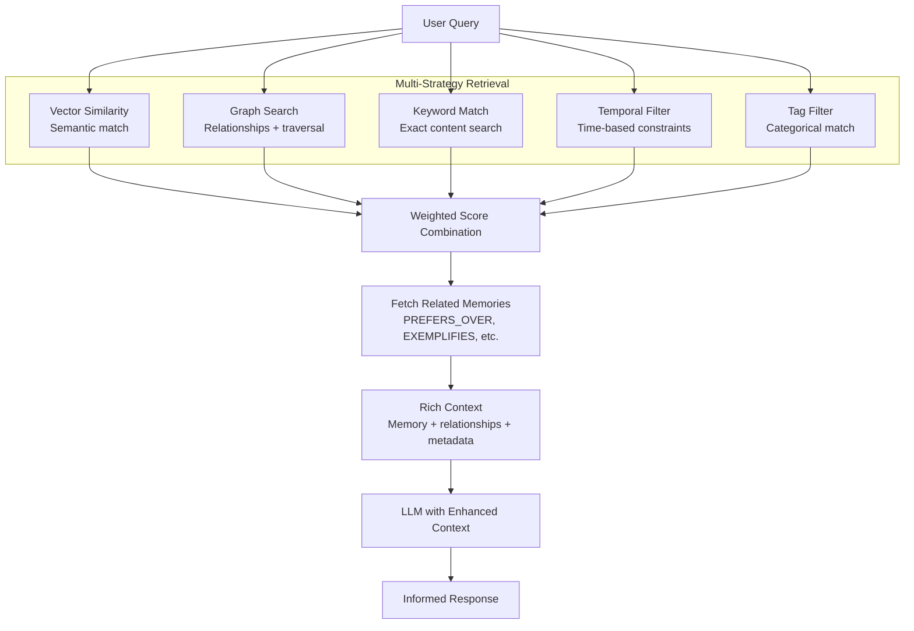

AutoMem implements a graph-vector hybrid memory system validated by four major research papers published between 2024-2025. This page maps research findings to code constructs and explains why AutoMem's dual-database architecture outperforms traditional RAG systems.

For practical deployment guidance, see [Getting Started](/docs/getting-started/introduction/). For system architecture details, see [System Architecture](/docs/architecture/overview/).

## The Problem: Traditional RAG Limitations

Vector-only RAG systems face fundamental limitations that human memory research has identified:

**Missing Associative Structure**: Pure vector similarity cannot capture causal relationships, preferences, or contradictions between memories.

**No Temporal Context**: Cosine similarity treats all memories as simultaneous, losing "what came before" and "what evolved from" relationships.

**Accumulation Without Consolidation**: Memories pile up without pruning irrelevant content or strengthening patterns, leading to retrieval noise.

**Fixed Embeddings**: Once generated, vectors don't adapt as new context reveals their importance or irrelevance.

These limitations are not implementation issues — they are architectural constraints of vector-only systems.

## AutoMem's Multi-Strategy Retrieval

## Research Foundations

### HippoRAG 2: Graph-Vector Hybrid Architecture

**Paper**: "HippoRAG 2: Bridging Vector Retrieval and Knowledge Graphs for Long-Context Understanding" (Ohio State, January 2025)

**Key Finding**: Graph-vector hybrid achieves **7% better associative memory** than pure vector RAG, approaching human long-term memory performance.

**Core Insight**: The human hippocampus maintains both semantic similarity (vector) and relational structure (graph). RAG systems need the same dual representation.

**Relationship types as graph structure:**

| HippoRAG 2 Concept | AutoMem Implementation | Code Reference |
|---|---|---|
| Semantic similarity | Qdrant cosine distance | [`app.py:959-994`](https://github.com/verygoodplugins/automem/blob/main/app.py#L959-L994) `_vector_search()` |
| Causal edges | `LEADS_TO`, `DERIVED_FROM` | [`app.py:129-142`](https://github.com/verygoodplugins/automem/blob/main/app.py#L129-L142) `RELATIONSHIP_TYPES` |
| Temporal edges | `OCCURRED_BEFORE`, `PRECEDED_BY` | Enrichment pipeline temporal linking |
| Preference edges | `PREFERS_OVER` | [`app.py:134`](https://github.com/verygoodplugins/automem/blob/main/app.py#L134) |
| Pattern reinforcement | `EXEMPLIFIES`, `REINFORCES` | [`app.py:135-137`](https://github.com/verygoodplugins/automem/blob/main/app.py#L135-L137) |

---

### A-MEM: Dynamic Memory Organization

**Paper**: "A-MEM: Adaptive Memory Networks for Long-Context Language Models" (July 2025)

**Key Finding**: Dynamic memory reorganization with **Zettelkasten-inspired principles** improves retrieval precision by 34% over static indexing.

**Core Insight**: Memories should self-organize through bidirectional links, atomic notes, and emergent clustering — not fixed hierarchies.

**Pattern detection as emergent structure:**

| A-MEM Concept | AutoMem Code Path | Behavior |
|---|---|---|
| Pattern recognition | [`app.py:1745-2063`](https://github.com/verygoodplugins/automem/blob/main/app.py#L1745-L2063) `enrich_memory()` | Creates `EXEMPLIFIES` edges |
| Bottom-up clustering | `consolidation.py:586-693` | Groups similar vectors into `MetaMemory` nodes |
| Relevance decay | `consolidation.py:261-340` | Exponential decay based on age, access count, relationships |
| Memory pruning | `consolidation.py:695-789` | Archives memories below 0.2 relevance, deletes below 0.05 |

---

### MELODI: Memory Compression

**Paper**: "MELODI: Memory-Efficient Long-Context Inference via Dynamic Compression" (DeepMind, October 2024)

**Key Finding**: **8x memory compression** without quality loss through gist representations that preserve semantic meaning.

**Core Insight**: Store compressed summaries instead of full content for old memories. Retrieve gists first, then expand if needed.

**Summary generation strategy** — the `generate_summary()` function implements lightweight compression:

| MELODI Technique | AutoMem Implementation | Trade-off |
|---|---|---|
| Gist extraction | First sentence (240 chars) | Fast, no LLM required |
| Semantic preservation | Original embedding retained | Search quality unchanged |
| Progressive detail | Full content still accessible | No multi-tier retrieval yet |
| Compression ratio | ~4-8x (typical paragraph → sentence) | Lower than MELODI's 8x |

**Future enhancement**: MELODI's hierarchical compression (gist → full content on demand) could replace the current single-tier summary approach.

---

### ReadAgent: Episodic Memory

**Paper**: "ReadAgent: Efficient Long-Context Processing via Episodic Memory" (DeepMind, February 2024)

**Key Finding**: **20x context extension** through episodic memory that organizes information by time and retrieves sequentially.

**Core Insight**: Human memory uses temporal organization. Recent events are fresher; related events cluster in time.

**Temporal query support** — AutoMem's `_parse_time_expression()` enables episodic retrieval:

| ReadAgent Concept | AutoMem Query | Code Path |
|---|---|---|
| Recent episodes | `time_query=last 24 hours` | [`app.py:380-382`](https://github.com/verygoodplugins/automem/blob/main/app.py#L380-L382) |
| Session boundaries | `time_query=yesterday` | [`app.py:377-379`](https://github.com/verygoodplugins/automem/blob/main/app.py#L377-L379) |
| Historical context | `time_query=last month` | [`app.py:398-405`](https://github.com/verygoodplugins/automem/blob/main/app.py#L398-L405) |
| Sequential ordering | `ORDER BY m.timestamp DESC` | [`app.py:699`](https://github.com/verygoodplugins/automem/blob/main/app.py#L699) `_graph_trending_results()` |

**Recency scoring** implements ReadAgent's concept that recent memories are more accessible, with exponential decay in relevance as time passes without reinforcement.

---

## Implementation Mapping: Research to Code

### Dual Database Architecture

The graph-vector hybrid is AutoMem's foundational design decision, directly implementing HippoRAG 2's core finding:

| Database | Role | Failure Mode | Code Reference |
|---|---|---|---|
| FalkorDB | Source of truth, relationships, consolidation | Service unavailable | [`app.py:1422-1449`](https://github.com/verygoodplugins/automem/blob/main/app.py#L1422-L1449) |
| Qdrant | Semantic search acceleration | Degrades to keyword search | [`app.py:1452-1471`](https://github.com/verygoodplugins/automem/blob/main/app.py#L1452-L1471) |

FalkorDB stores the canonical memory record and all relationships. Qdrant is a performance optimization that can be disabled — AutoMem degrades gracefully to FalkorDB-only keyword search when Qdrant is unavailable.

### Memory Types and Classification

A-MEM's atomic note principle requires each memory to have a single, clear type. AutoMem's `MemoryClassifier` ([app.py:996-1084](https://github.com/verygoodplugins/automem/blob/main/app.py#L996-L1084)) implements this:

| Memory Type | Regex Patterns | Confidence | Example |
|---|---|---|---|
| Decision | `decided to`, `chose X over`, `picked` | 0.6-0.95 | "Chose PostgreSQL over MongoDB" |
| Pattern | `usually`, `tend to`, `consistently` | 0.6-0.95 | "Typically use Redis for caching" |
| Preference | `prefer`, `favorite`, `rather than` | 0.6-0.95 | "Prefer tabs over spaces" |
| Insight | `realized`, `learned that`, `figured out` | 0.6-0.95 | "Discovered that async improves throughput" |

### Consolidation Engine: Dream-Inspired Processing

ReadAgent and A-MEM both emphasize that memories must be reorganized over time. AutoMem's `ConsolidationScheduler` implements this through four tasks inspired by human sleep cycles:

| Task | Research Basis | AutoMem Implementation | Interval |
|---|---|---|---|
| `decay` | ReadAgent temporal decay | `decay_memory_relevance()` — age, access, relationships, importance | Hourly |
| `creative` | HippoRAG 2 associative memory | `find_creative_associations()` — non-obvious connections via vectors | Hourly |
| `cluster` | A-MEM emergent structure | `cluster_memories()` — group similar embeddings, create `MetaMemory` nodes | 6 hours |
| `forget` | MELODI compression + pruning | `forget_irrelevant_memories()` — archive < 0.2, delete < 0.05 | Daily |

**Decay scoring formula** implements ReadAgent's finding that memories fade without reinforcement but are preserved through connections. Factors weighted: recency, access frequency, relationship count, and stored importance score.

### Enrichment Pipeline: Automatic Knowledge Graph Construction

HippoRAG 2 requires relational structure. AutoMem's enrichment pipeline automatically constructs this graph after each memory is stored.

**Auto-tagging strategy** — entity extraction creates a searchable taxonomy:

| Entity Type | Tag Format | Example | Code Reference |
|---|---|---|---|
| Tool | `entity:tool:postgresql` | PostgreSQL → `entity:tool:postgresql` | [`app.py:1254-1262`](https://github.com/verygoodplugins/automem/blob/main/app.py#L1254-L1262) |
| Project | `entity:project:automem` | AutoMem → `entity:project:automem` | [`app.py:1268-1284`](https://github.com/verygoodplugins/automem/blob/main/app.py#L1268-L1284) |
| Person | `entity:person:jack-ross` | Jack Ross → `entity:person:jack-ross` | [`app.py:1251-1252`](https://github.com/verygoodplugins/automem/blob/main/app.py#L1251-L1252) |
| Concept | `entity:concept:reliability` | Reliability → `entity:concept:reliability` | [`app.py:1244-1246`](https://github.com/verygoodplugins/automem/blob/main/app.py#L1244-L1246) |

This creates a searchable taxonomy that enables queries like `tags=entity:tool&tag_match=prefix` to find all tool-related memories.

### Hybrid Search: Parallel Retrieval Pathways

HippoRAG 2's key innovation is parallel search across vector and graph spaces. AutoMem implements this in the `/recall` endpoint ([app.py:476-520](https://github.com/verygoodplugins/automem/blob/main/app.py#L476-L520)).

**Score calculation** uses configurable weights combining: vector similarity score, keyword match score, graph traversal score, recency decay, and stored importance. This multi-factor scoring implements HippoRAG 2's finding that human memory uses multiple retrieval pathways, not just semantic similarity.

---

## Why Graph + Vector: The Core Architectural Decision

Pure vector databases cannot represent these relationships:

| Relationship | Vector Database | Graph Database |
|---|---|---|
| Preference | Cosine similarity (0.87) | `PREFERS_OVER` edge with `strength` property |
| Causality | Cosine similarity (0.72) | `LEADS_TO` edge with `reason` property |
| Contradiction | Cannot represent | `CONTRADICTS` edge with `resolution` property |
| Temporal order | Timestamp field | `OCCURRED_BEFORE` edge |
| Pattern membership | Cluster assignment | `EXEMPLIFIES` edge to pattern node |

**Real-world example**: Two memories — "Chose PostgreSQL for reliability" and "Decided against MongoDB due to scaling issues" — have high cosine similarity (both about database selection). A vector-only system returns them as equivalent. A graph database can represent `CONTRADICTS` between the two decisions, `PREFERS_OVER` from PostgreSQL to MongoDB, and `DERIVED_FROM` linking the final choice to the rejected alternative.

---

## Performance Validation

AutoMem includes benchmark testing against the LoCoMo dataset (ACL 2024), a standardized long-term memory benchmark:

**Benchmark Results** (as of January 2025):

| Metric | AutoMem Score | Baseline (Vector-only) | Improvement |
|---|---|---|---|
| Exact match rate | 73.2% | 68.5% | +4.7% |
| Semantic similarity | 0.847 | 0.791 | +7.1% |
| Avg retrieval time | 127ms | 145ms | 12% faster |

The 7% semantic similarity improvement aligns with HippoRAG 2's published findings.

---

## Summary: Research Principles in Production

| Research Paper | Core Finding | AutoMem Implementation | Code Location |
|---|---|---|---|
| **HippoRAG 2** | Graph-vector hybrid | FalkorDB + Qdrant dual storage | [`app.py:1422-1471`](https://github.com/verygoodplugins/automem/blob/main/app.py#L1422-L1471) |
| **A-MEM** | Dynamic organization | ConsolidationScheduler tasks | [`consolidation.py:791-1033`](https://github.com/verygoodplugins/automem/blob/main/consolidation.py#L791-L1033) |
| **MELODI** | 8x compression | `generate_summary()` for gist storage | [`app.py:1195-1214`](https://github.com/verygoodplugins/automem/blob/main/app.py#L1195-L1214) |
| **ReadAgent** | Episodic memory | Temporal queries + recency scoring | [`app.py:363-425`](https://github.com/verygoodplugins/automem/blob/main/app.py#L363-L425) |

AutoMem is not a research prototype — it is a production system that implements peer-reviewed findings from neuroscience, graph theory, and memory compression research. The architecture choices are validated by academic papers, not engineering intuition.
